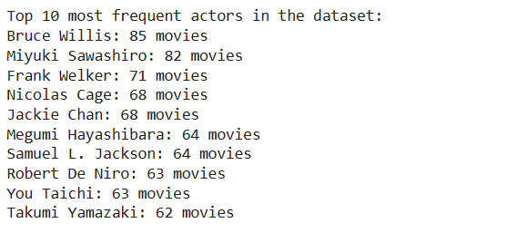
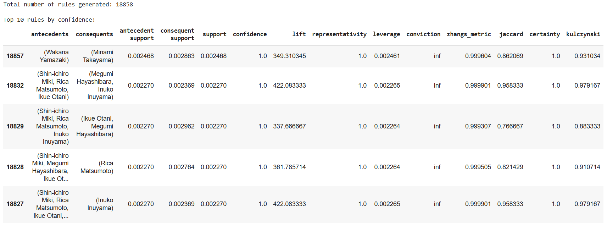
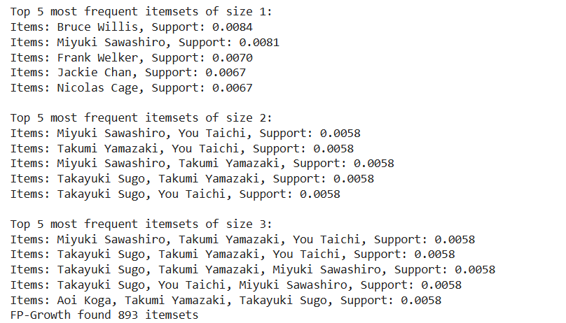
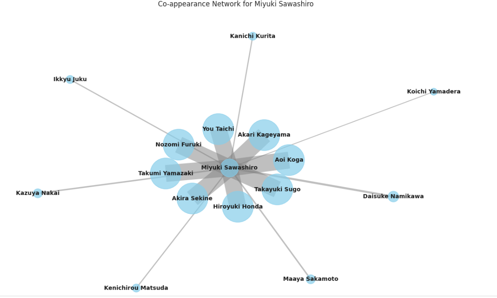
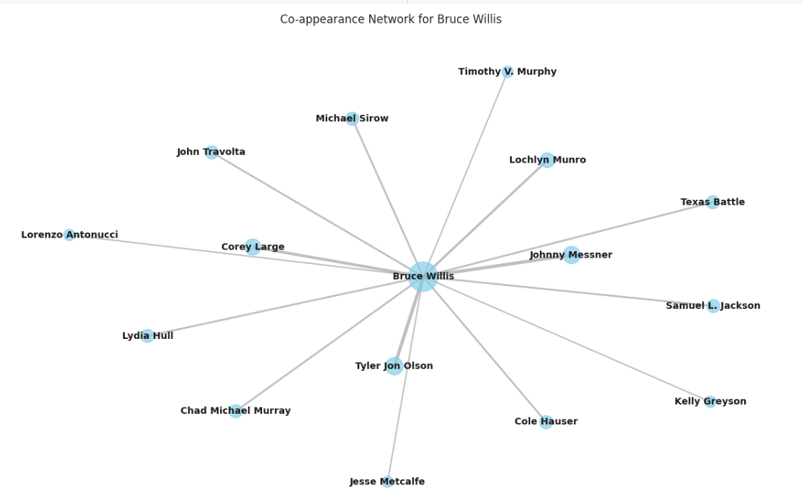
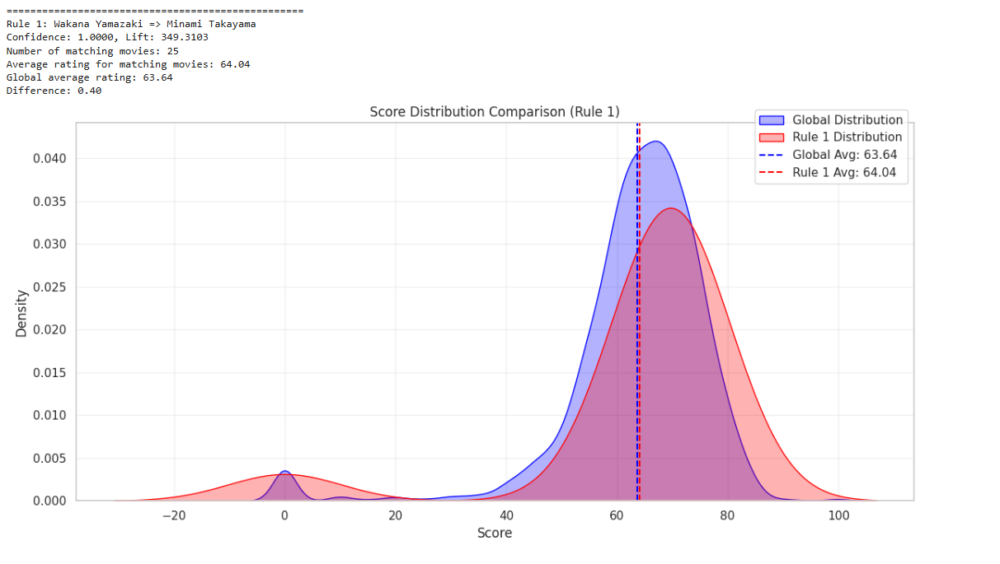
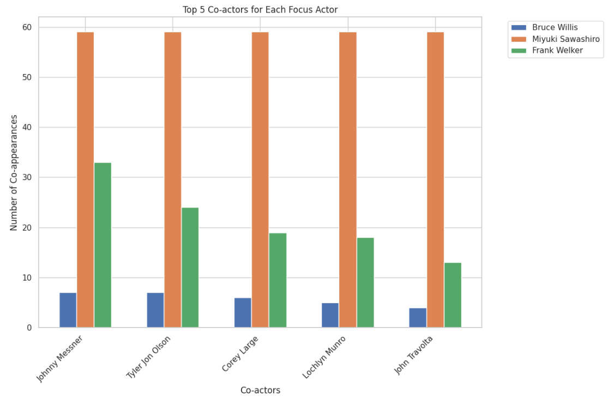

# 🎬 DataPlorer: IMDB Actor Collaboration Analysis  

## 📌 Project Overview  

Actor collaborations significantly shape the film industry, influencing both casting choices and commercial outcomes. This project analyzes professional relationships within the IMDB movie dataset to uncover hidden patterns that impact entertainment production.  

Using **frequent pattern mining, association rule mining, and network analysis**, we identify recurring actor combinations and visualize their collaborative networks. The study focuses on prominent performers such as **Miyuki Sawashiro, Frank Welker, and Bruce Willis**, comparing their distinctive collaboration patterns.  

By revealing these professional connections, our work provides meaningful insights into how different segments of the global entertainment industry approach **talent utilization and team building**.  

---

## 🔑 Key Features

- **Data Cleaning & Preparation** – Preprocessed IMDB dataset for analysis.  
- **Frequent Pattern Mining** – Discovered recurring actor combinations.  
- **Association Rule Mining** – Identified rules that explain actor co-appearances.  
- **Network Analysis & Visualization** – Built collaboration networks to highlight relationships.  
- **Case Studies** – Compared collaboration patterns of select top actors.  

---

## 🛠️ Tech Stack  

- **Languages**: Python  
- **Libraries**: Pandas, NumPy, Matplotlib, Seaborn, NetworkX, mlxtend, Scikit-learn  
- **Environment**: Jupyter Notebook  

---

## 📊 Insights & Findings

- Certain actors form strong recurring clusters, shaping genre-specific collaborations.  
- Bruce Willis shows frequent partnerships within action films, while Miyuki Sawashiro’s collaborations reveal strong ties in anime/voice acting.  
- Frank Welker, known for extensive voice roles, demonstrates the highest variety of cross-project collaborations.  

---

## 📂 Dataset

This project uses the **IMDB Movies Dataset** from Kaggle.  
You can download the full unfiltered dataset from here: [IMDB Movies Dataset on Kaggle](https://www.kaggle.com/datasets/ashpalsingh1525/imdb-movies-dataset)  

Or

You can find used/filtered dataset (`imdb.csv`) into a folder named `data/` in the repository.  

---

## 🚀 How to Run  

1. Clone this repository:

   ```bash
   git clone https://github.com/imkaushal10/DataPlorer-IMDB-Analysis.git
   cd DataPlorer-IMDB-Analysis
   ```

2. Install dependencies:

   ```bash
   pip install -r requirements.txt
   ```

3. Open the notebook:

   ```bash
   jupyter notebook DataPlorer_Final_File.ipynb
   ```

4. Run all cells to reproduce results.  

---

## 📂 Project Structure

``` bash
├── DataPlorer_Final_File.ipynb   # Main notebook with analysis
├── README.md                     # Project documentation
├── requirements.txt              # Dependencies
├── data/                         # Dataset 
└── images/                       # 📸 Screenshots and visualizations
```

---

## 📈 Example Visualizations  

Most Frequent Actors:  
  

Rule Mining:  
  

FP-Growth:  


Network-Graph:  

  


Score Distribution:  


Visualization Of Co-actors For Each Focus Actor:  


## Author

Kaushal Bhattarai
**Email**: [bhattaraikaushal123@gmail.com]
